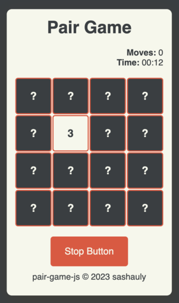

# tenzies-react

> Simple Pair Game in vanilla Javascript.
> Live demo [_here_](https://sashauly.github.io/pair-game-js.github.io/).

## Table of Contents
- [tenzies-react](#tenzies-react)
  - [Table of Contents](#table-of-contents)
  - [General Information](#general-information)
  - [Technologies Used](#technologies-used)
  - [Features](#features)
  - [Setup](#setup)
  - [Project status](#project-status)
  - [Contacts](#contacts)

## General Information
- This is a game implemented in JavaScript.
- Project developed in educational purposes to get familiar with DOM structures, arrow functions, arrays and objects in JavaScript.
  - HTML file contains only basic tags in `<head>` section. All the other stuff is in the `pair-game.js` file.
  - In CSS I mainly use `em` format for font-sizes, margin, etc. to get familiar with them either.
  - Tested in Chrome, Firefox and Safari browsers on desktop and mobile versions.

## Technologies Used
- JavaScript ES6
- HTML5

## Features
Rules are simple: 
   - Choose a number of cards in rows and columns, click 'Start Game'.
   - Then you have memorize as much pair of cards as you can, but be careful - you have a little time for that! 
   - And then you have to pick a pair of cards with identical numbers. 
### Good luck!

## Setup
Just open [the live version](https://sashauly.github.io/pair-game-js.github.io/). For now this project served for presentation purposes

## Project status

Project is: _complete_

## Contacts

Created by [@sashauly](https://t.me/sashauly) - feel free to contact me!
